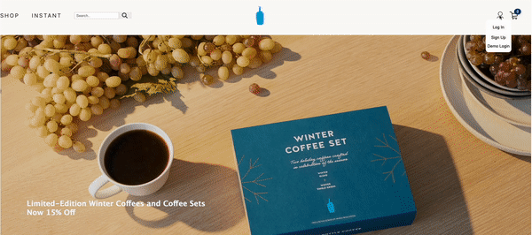

# Background

BlueVelvetCoffee is a website clone of BlueBottleCoffee. User can shop various products based on their requirement. When you expolore this beautiful website, you will definetly have user-friendly experience. It is designed in such a way that user will not feel lost while using the website. 

# Technology

* __React__ - An frontend library for building user interfaces. It is maintained by Facebook and a community of individual developers and companies.
* __Redux__ - A predictable, centralized state container for JavaScript apps.
* __Ruby on Rails__ - Backend framework will boiler plate to develop MVC workflow.
* __BCrypt__ - User auth package to generate password hash with salt.
* __Database__ - PostgreSQL.
* __Other__ AWS for image storage and uploads, Google Map API.

# Features

### User Authentication - LogIn/SignUp/DemoLogin

User can logIn or signup or can login using demologin to explore some extra features. Backend uses BCrypt to authenticate user details. 

Uer can add products of their choice to cart. Adding product to cart is only possible if a user is logged in

User can write/update/Delete review.

Search bar is added to search desired product.

